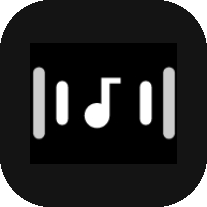

<div align="center">



# 🎵 RhythmicTouch

**🎶 Let your motor dance to the rhythm 🎶**

*🔊 LSPosed Module · Capture music rhythm from system audio and trigger haptic feedback*

[](https://github.com/LyonHyrik/RhythmicTouch/actions/workflows/build.yml)
[](LICENSE)
[](https://developer.android.com/about/versions/pie)

</div>

---

## 🏗️ Architecture

```
┌──────────────┐         ┌──────────────────┐
│   SystemUI   │         │  App (e.g. Phira)│
│  AudioTrack  │         │  Oboe / AAudio   │
└──────┬───────┘         └────────┬─────────┘
       │  Xposed Hook             │  C++ Native GOT Hook
       ▼                          ▼
┌─────────────────────────────────────────────┐
│             RhythmicEngine                  │
│  32-band FFT  →  Beat Analysis              │
│  Adaptive Threshold  +  Mode Matching       │
└─────────────────────┬───────────────────────┘
                      │
                      ▼
┌─────────────────────────────────────────────┐
│            VibratorDriver                   │
│  8 Vibration Modes · Per-mode Band Filter   │
└─────────────────────────────────────────────┘
```

### 🔗 Dual Data Pipeline

| 🔹 Pipeline | 🎯 Hook Target | 🎤 Capture Method | 📊 Data |
|-------------|---------------|-------------------|---------|
| **SystemUI** | `com.android.systemui` | Xposed Hook AudioTrack / AAudio | 🎵 Global media audio stream |
| **App** | `org.flos.phira` etc. | C++ GOT Hook `AAudioStream_write()` | 🎮 In-app Oboe PCM raw data |

Both pipelines feed into a single `RhythmicEngine`, where `BeatAnalyzer` performs 32-band FFT analysis, then matches vibration modes based on energy distribution, beat detection, and adaptive thresholds.

## ✨ Features

- 🎛️ **32-band FFT Real-time Analysis** — Based on Oboe native audio capture, 33ms frame rate
- 📳 **8 Vibration Modes** — 💥Heavy Long / 💢Heavy Short / 🎵Mid Tap / ⚡Medium Hit / 🎶Rising Tap / 🔊Long Pulse / 🔄Emotion Pulse / ✨Soft Tick
- 🎚️ **Per-mode Band Configuration** — Each mode has independent trigger band range or manual band selection
- 📁 **Multi-profile System** — Create multiple configuration profiles, auto-switch by app (scope-based)
- 📤 **Profile Import/Export** — Single JSON or batch ZIP packaging for sharing
- 🧠 **Adaptive Thresholds** — Dynamically adjust trigger sensitivity based on historical energy
- 🌐 **Internationalization** — Chinese/English bilingual UI
- ⏰ **Quiet Period** — Schedule haptic feedback to pause during specific time ranges
- 🔧 **Daemon Process** — Background service for persistent haptic monitoring
- 🎨 **Miuix UI** — Material You dynamic color theme

## 📋 Requirements

- 🤖 Android 9+ (API 28+)
- 🔧 [LSPosed](https://github.com/LSPosed/LSPosed) / EdXposed
- ✅ `com.android.systemui` scope must be selected

## 📱 Supported Devices

| 📱 Device | 🤖 System Version | 📝 Status |
|-----------|-------------------|-----------|
| OPPO Reno8 Pro | ColorOS 14.0 | ✅ Verified |
| Nothing Phone (3) | Android 16 | ✅ Verified |

> 💡 Welcome to submit new device test results! Other models please test yourself.

## 📥 Installation

1. ⬇️ Download APK from [Releases](https://github.com/LyonHyrik/RhythmicTouch/releases)
2. 📦 Install and enable module in LSPosed
3. ☑️ Select `com.android.systemui` scope
4. 🎮 (Optional) Select target app like Phira to enable app-side native capture
5. 🔄 Restart SystemUI or reboot device

## 🔨 Build

```bash
./gradlew assembleDebug
```

📦 APK output at `app/build/outputs/apk/debug/app-debug.apk`

## 👤 Author

- 🌐 Blog: [https://lyonhyrik.github.io/](https://lyonhyrik.github.io/)
- 📱 CoolApk: [LyonHyrik](https://www.coolapk.com/u/24533526)
- 💻 GitHub: [LyonHyrik](https://github.com/LyonHyrik)

## 📜 License

[GNU Affero General Public License v3.0](LICENSE)
